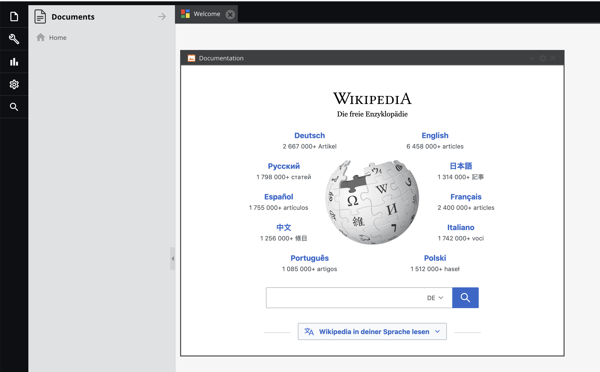

# Iframe Portlet Bundle

With this bundle you can embed websites into your Pimcore dashboard. 

The URL of the iframe is configurable in portlet settings.

## Installation

You can install the bundle with `composer require blackbit_digital_commerce/pimcore-iframe-portlet`. Later updates can be done via `composer update blackbit_digital_commerce/pimcore-iframe-portlet`.